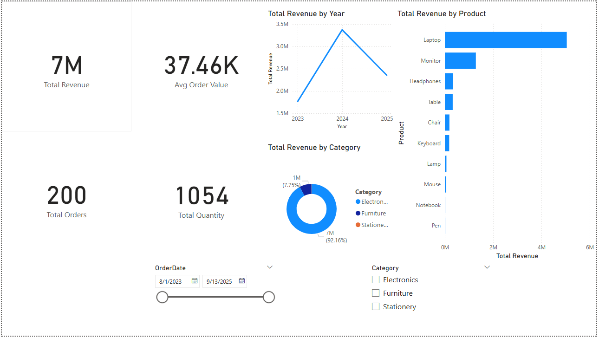

# PowerBI-Sales-Dashboard
📊 Interactive Sales Dashboard built with Power BI, showing KPIs, trends, and category insights.

📊 This project visualizes sales data using **Power BI**.

## Dataset
- `sales_data_ready.csv` (sales transactions with Date, Product, Category, Revenue, Quantity)

## Dashboard Features
- KPI Cards: Total Revenue, Quantity Sold, Orders, Avg Order Value
- Line Chart: Monthly Sales Trend
- Pie Chart: Category-wise Sales Distribution
- Bar Chart: Top Products by Revenue
- Slicers: Filter by Category and Date

## Screenshots

## Insights
- Electronics generated the highest revenue 📈
- Sales peak in December (holiday season) 🎉
- Top 3 products contribute 45% of total revenue

